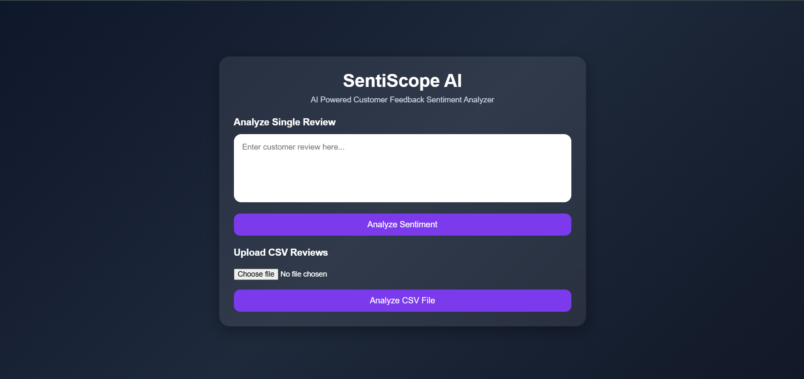
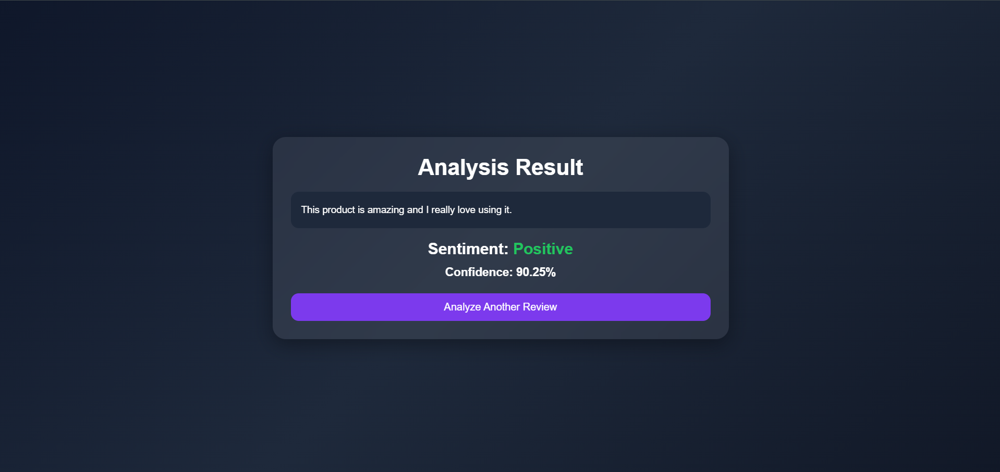
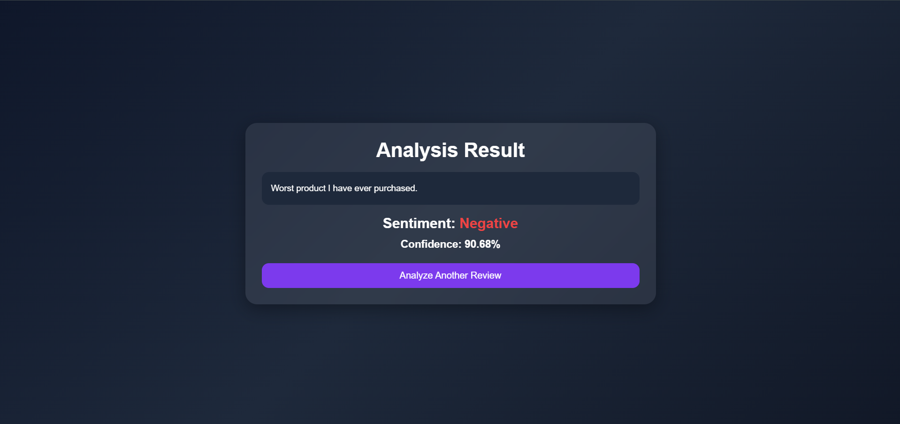
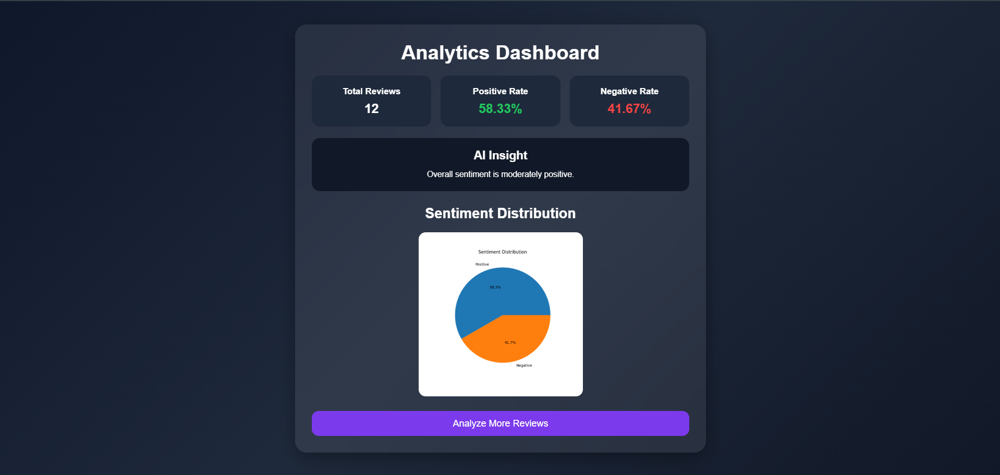

# 🚀 SentiScope AI

## AI-Powered Customer Feedback Sentiment Analyzer

SentiScope AI is an end-to-end **Natural Language Processing (NLP)** and **Machine Learning** web application that automatically analyzes text sentiment and classifies customer feedback into **Positive** or **Negative** categories with high prediction confidence.

The system helps businesses understand customer opinions, monitor product/service feedback, and make data-driven decisions through automated sentiment analysis and analytics visualization.

---

## 🌟 Key Highlights

* Built complete **ML pipeline from scratch**
* Trained on **25,000 labeled reviews dataset**
* Achieved **89.74% model accuracy on IMDb review dataset**
* Supports **real-time single text prediction**
* Supports **bulk CSV review analysis**
* Interactive **analytics dashboard with visualization**
* Generates **business insight based on sentiment distribution**
* Fully integrated **Flask web application with modern UI**

---

## 📖 Problem Statement

Organizations receive thousands of reviews, ratings, and customer feedback across products, services, and applications.

Manually analyzing this data is difficult, time-consuming, and inefficient.

SentiScope AI solves this problem by automatically classifying feedback sentiment and providing analytical insights that help businesses understand customer satisfaction and improve decision-making.

---

## ⚡ Features

### 1. Real-Time Sentiment Analysis

Users can enter text directly into the web application and instantly classify sentiment.

Example:

Input:

Excellent product quality and very fast delivery.

Output:

```text
Sentiment → Positive  
Confidence Score → 97.98%
```

---

### 2. Bulk CSV Analysis

Upload CSV files containing multiple reviews.

Example format:

```csv
review
Amazing product quality
Poor customer support
Fast delivery service
Terrible experience overall
```

The application automatically processes every review and performs batch sentiment classification.

---

### 3. Analytics Dashboard

After CSV upload, the dashboard displays:

* Total Reviews Processed
* Positive Sentiment Percentage
* Negative Sentiment Percentage
* Pie Chart Visualization
* Automated AI Business Insight

---

### 4. Confidence Score Prediction

Every prediction includes confidence score generated by the trained machine learning model.

Example:

```text
Positive → 96.42%
Negative → 94.83%
```

---

## 🧠 Machine Learning Architecture

The project follows a complete NLP pipeline.

```text
Raw Dataset
    ↓
Text Preprocessing
    ↓
Stopword Removal
    ↓
TF-IDF Vectorization
    ↓
Logistic Regression Model
    ↓
Sentiment Prediction
    ↓
Analytics Dashboard
```

---

## 📊 Model Performance

| Metric | Value |
|----------|----------|
| Dataset | IMDb Review Dataset |
| Dataset Size | 25,000 Reviews |
| Classes | Positive / Negative |
| Algorithm | Logistic Regression |
| Vectorization | TF-IDF |
| Final Accuracy | 89.74% |

---

## 🛠️ Technology Stack

### Backend

* Python
* Flask

### Machine Learning

* Scikit-learn
* Logistic Regression
* TF-IDF Vectorizer

### NLP Processing

* NLTK
* Stopword Removal
* Text Cleaning Pipeline

### Data Handling

* Pandas
* NumPy

### Visualization

* Matplotlib

### Frontend

* HTML5
* CSS3
* JavaScript

---

## 📂 Project Architecture

```text
sentiscope-ai/
│
├── app.py
├── requirements.txt
├── README.md
│
├── dataset/
├── uploads/
│
├── models/
│   ├── sentiment_model.pkl
│   └── vectorizer.pkl
│
├── training/
│   └── train_model.py
│
├── utils/
│   ├── preprocess.py
│   └── predictor.py
│
├── templates/
│   ├── index.html
│   ├── result.html
│   └── dashboard.html
│
└── static/
    ├── style.css
    └── chart.png
```

---

## 📸 Application Screenshots

### 🏠 Home Page



Main landing page containing:

* Text input box  
* CSV upload section  

---

### ✅ Positive Sentiment Prediction



Example:

`Excellent service and amazing quality.`

---

### ❌ Negative Sentiment Prediction



Example:

`Worst product ever and complete waste of money.`

---

### 📈 Analytics Dashboard



Includes:

* Pie chart visualization  
* Positive sentiment percentage  
* Negative sentiment percentage  
* AI-generated business insight  

---

## ⚙️ Installation Guide

Clone repository

```bash
git clone <your-repository-url>
```

Move into project directory

```bash
cd sentiscope-ai
```

Install dependencies

```bash
pip install -r requirements.txt
```

Run application

```bash
python app.py
```

Open browser

```text
http://127.0.0.1:5000
```

---

## 🧪 Sample Testing Inputs

### Positive Example

```text
Excellent customer service and amazing product quality.
```

### Negative Example

```text
Very poor experience and terrible support service.
```

### CSV Test File

```csv
review
Amazing product quality
Poor customer support
Fast delivery service
Terrible experience overall
Excellent packaging
Worst purchase ever
```

---

## 🎯 Real World Applications

This project can be applied in:

* Product Review Analysis  
* Customer Feedback Monitoring  
* E-commerce Review Systems  
* Brand Reputation Monitoring  
* Social Media Opinion Analysis  
* App Store Review Classification  
* Customer Satisfaction Tracking  

---

## 🔮 Future Enhancements

Planned improvements:

* Neutral sentiment classification  
* Deep Learning based prediction  
* Live API deployment  
* Interactive analytics dashboard  
* Historical sentiment tracking  
* Database integration  
* Multi-language sentiment analysis  

---

## 👨‍💻 Developer

**CH BHANU PRAKASH**

GitHub: https://github.com/bhanuprakash2508  

LinkedIn: https://linkedin.com/in/bhanuprakash-chintha  

---

## 📌 Project Outcome

SentiScope AI demonstrates practical implementation of:

* Natural Language Processing  
* Machine Learning Model Development  
* Web Application Development  
* Data Visualization  
* Business Intelligence through Sentiment Analysis  

The project successfully combines **AI + NLP + Web Development** into a real-world solution for automated sentiment understanding.

---

### ⭐ If you found this project useful, consider giving it a star.